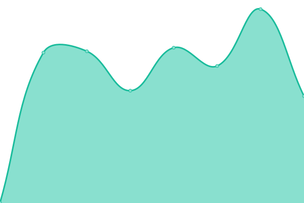

# [📈 Live Status](https://demo.upptime.js.org): <!--live status--> **🟧 Partial outage**

This repository contains the open-source uptime monitor and status page for [Fourth Floor Interactive](http://www.fourthfloorinteractive.com), powered by [Upptime](https://github.com/upptime/upptime).

With [Upptime](https://upptime.js.org), you can get your own unlimited and free uptime monitor and status page, powered entirely by a GitHub repository. We use [Issues](https://github.com/fourthfloor/uptime/issues) as incident reports, [Actions](https://github.com/fourthfloor/uptime/actions) as uptime monitors, and [Pages](https://demo.upptime.js.org) for the status page.

<!--start: status pages-->
<!-- This summary is generated by Upptime (https://github.com/upptime/upptime) -->
<!-- Do not edit this manually, your changes will be overwritten -->
<!-- prettier-ignore -->
| URL | Status | History | Response Time | Uptime |
| --- | ------ | ------- | ------------- | ------ |
|  [Fourth Floor Interactive](https://www.fourthfloorinteractive.com) | 🟩 Up | [fourth-floor-interactive.yml](https://github.com/fourthfloor/uptime/commits/HEAD/history/fourth-floor-interactive.yml) | 

 394ms
     
 | 

<a href="https://fourthfloor.github.io/uptime/history/fourth-floor-interactive">100.00%</a>
    

|  [Fourth Projects](https://www.fourthprojects.com) | 🟩 Up | [fourth-projects.yml](https://github.com/fourthfloor/uptime/commits/HEAD/history/fourth-projects.yml) | 

 450ms
     
 | 

<a href="https://fourthfloor.github.io/uptime/history/fourth-projects">100.00%</a>
    

|  [Go Fish Academy & Tacklebox](https://www.gofishacademy.com) | 🟩 Up | [go-fish-academy-and-tacklebox.yml](https://github.com/fourthfloor/uptime/commits/HEAD/history/go-fish-academy-and-tacklebox.yml) | 

 2176ms
     
 | 

<a href="https://fourthfloor.github.io/uptime/history/go-fish-academy-and-tacklebox">100.00%</a>
    

|  [Test Broken Site](https://thissitedoesnotexist.koj.co) | 🟥 Down | [test-broken-site.yml](https://github.com/fourthfloor/uptime/commits/HEAD/history/test-broken-site.yml) | 

 0ms
     
 | 

<a href="https://fourthfloor.github.io/uptime/history/test-broken-site">100.00%</a>
    

<!--end: status pages-->

[**Visit our status website →**](https://demo.upptime.js.org)

## 📄 License

- Powered by: [Upptime](https://github.com/upptime/upptime)
- Code: [MIT](./LICENSE) © [Fourth Floor Interactive](http://www.fourthfloorinteractive.com)
- Data in the `./history` directory: [Open Database License](https://opendatacommons.org/licenses/odbl/1-0/)
