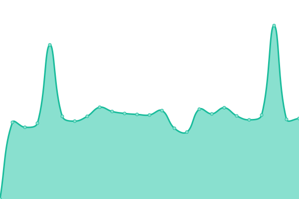

# [📈 Live Status](https://demo.upptime.js.org): <!--live status--> **🟧 Partial outage**

This repository contains the open-source uptime monitor and status page for [Fourth Floor Interactive](http://www.fourthfloorinteractive.com), powered by [Upptime](https://github.com/upptime/upptime).

With [Upptime](https://upptime.js.org), you can get your own unlimited and free uptime monitor and status page, powered entirely by a GitHub repository. We use [Issues](https://github.com/fourthfloor/uptime/issues) as incident reports, [Actions](https://github.com/fourthfloor/uptime/actions) as uptime monitors, and [Pages](https://demo.upptime.js.org) for the status page.

<!--start: status pages-->
<!-- This summary is generated by Upptime (https://github.com/upptime/upptime) -->
<!-- Do not edit this manually, your changes will be overwritten -->
<!-- prettier-ignore -->
| URL | Status | History | Response Time | Uptime |
| --- | ------ | ------- | ------------- | ------ |
|  [Fourth Floor Interactive](https://www.fourthfloorinteractive.com) | 🟩 Up | [fourth-floor-interactive.yml](https://github.com/fourthfloor/uptime/commits/HEAD/history/fourth-floor-interactive.yml) | 

 353ms
     
 | 

<a href="https://fourthfloor.github.io/uptime/history/fourth-floor-interactive">99.79%</a>
    

|  [Fourth Projects](https://www.fourthprojects.com) | 🟩 Up | [fourth-projects.yml](https://github.com/fourthfloor/uptime/commits/HEAD/history/fourth-projects.yml) | 

 424ms
     
 | 

<a href="https://fourthfloor.github.io/uptime/history/fourth-projects">100.00%</a>
    

|  [Go Fish Academy & Tacklebox](https://www.gofishacademy.com) | 🟩 Up | [go-fish-academy-and-tacklebox.yml](https://github.com/fourthfloor/uptime/commits/HEAD/history/go-fish-academy-and-tacklebox.yml) | 

 2387ms
     
 | 

<a href="https://fourthfloor.github.io/uptime/history/go-fish-academy-and-tacklebox">99.81%</a>
    

|  [Gahanna Area Chamber](https://www.gahannaareachamber.com) | 🟥 Down | [gahanna-area-chamber.yml](https://github.com/fourthfloor/uptime/commits/HEAD/history/gahanna-area-chamber.yml) | 

 0ms
     
 | 

<a href="https://fourthfloor.github.io/uptime/history/gahanna-area-chamber">0.00%</a>
    

|  [Wishing Out Loud](https://www.wishingoutloud.com) | 🟩 Up | [wishing-out-loud.yml](https://github.com/fourthfloor/uptime/commits/HEAD/history/wishing-out-loud.yml) | 

 397ms
     
 | 

<a href="https://fourthfloor.github.io/uptime/history/wishing-out-loud">100.00%</a>
    

|  [Welcome Change](https://www.welcomechange.com) | 🟩 Up | [welcome-change.yml](https://github.com/fourthfloor/uptime/commits/HEAD/history/welcome-change.yml) | 

 2013ms
     
 | 

<a href="https://fourthfloor.github.io/uptime/history/welcome-change">99.84%</a>
    

|  [Silver Ink Publishing](https://www.silverinkpublishing.com) | 🟩 Up | [silver-ink-publishing.yml](https://github.com/fourthfloor/uptime/commits/HEAD/history/silver-ink-publishing.yml) | 

 588ms
     
 | 

<a href="https://fourthfloor.github.io/uptime/history/silver-ink-publishing">99.85%</a>
    

|  [World of Words WOW](https://www.worldofwordswow.com) | 🟩 Up | [world-of-words-wow.yml](https://github.com/fourthfloor/uptime/commits/HEAD/history/world-of-words-wow.yml) | 

 552ms
     
 | 

<a href="https://fourthfloor.github.io/uptime/history/world-of-words-wow">100.00%</a>
    

|  [Basic](https://www.basic.co.uk) | 🟩 Up | [basic.yml](https://github.com/fourthfloor/uptime/commits/HEAD/history/basic.yml) | 

 851ms
     
 | 

<a href="https://fourthfloor.github.io/uptime/history/basic">99.74%</a>
    

|  [Basic Online](https://www.basiconline.net) | 🟩 Up | [basic-online.yml](https://github.com/fourthfloor/uptime/commits/HEAD/history/basic-online.yml) | 

 579ms
     
 | 

<a href="https://fourthfloor.github.io/uptime/history/basic-online">99.75%</a>
    

|  [Yudu Salons](https://www.yudusalons.com) | 🟩 Up | [yudu-salons.yml](https://github.com/fourthfloor/uptime/commits/HEAD/history/yudu-salons.yml) | 

 915ms
     
 | 

<a href="https://fourthfloor.github.io/uptime/history/yudu-salons">100.00%</a>
    

|  [Central Home Systems](https://www.chomesystems.com) | 🟩 Up | [central-home-systems.yml](https://github.com/fourthfloor/uptime/commits/HEAD/history/central-home-systems.yml) | 

 918ms
     
 | 

<a href="https://fourthfloor.github.io/uptime/history/central-home-systems">100.00%</a>
    

|  [C|Suites](https://www.csuitesoffices.com) | 🟩 Up | [c-suites.yml](https://github.com/fourthfloor/uptime/commits/HEAD/history/c-suites.yml) | 

 635ms
     
 | 

<a href="https://fourthfloor.github.io/uptime/history/c-suites">100.00%</a>
    

|  [Advantage Print Solutions](https://www.advantageprintsolutions.com) | 🟩 Up | [advantage-print-solutions.yml](https://github.com/fourthfloor/uptime/commits/HEAD/history/advantage-print-solutions.yml) | 

 1371ms
     
 | 

<a href="https://fourthfloor.github.io/uptime/history/advantage-print-solutions">97.69%</a>
    

<!--end: status pages-->

[**Visit our status website →**](https://demo.upptime.js.org)

## 📄 License

- Powered by: [Upptime](https://github.com/upptime/upptime)
- Code: [MIT](./LICENSE) © [Fourth Floor Interactive](http://www.fourthfloorinteractive.com)
- Data in the `./history` directory: [Open Database License](https://opendatacommons.org/licenses/odbl/1-0/)
